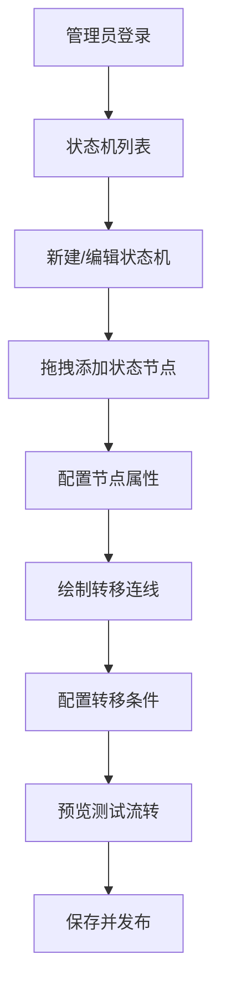
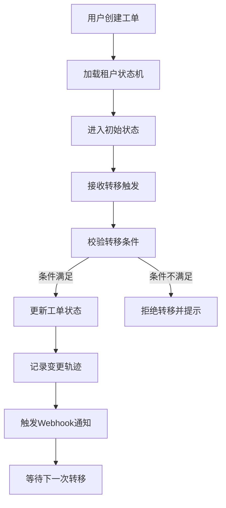
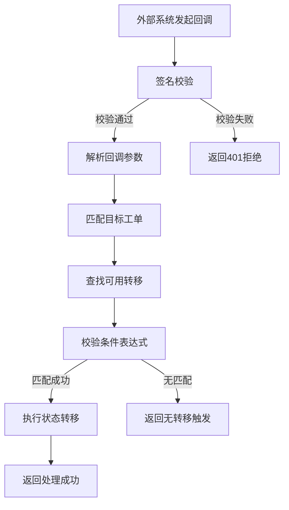

## 1. 产品概述

企业级工单系统核心路由引擎，提供轻量级可视化有限状态机（FSM）配置能力，支持多租户隔离、外部系统HTTP回调触发、状态变更轨迹追踪和Webhook通知。

- 解决企业跨系统工单流转配置复杂、维护成本高的问题，管理员通过拖拽界面即可定义工单生命周期
- 目标用户为企业IT管理员、业务流程配置人员，支持CRM、ERP等外部系统集成
- 核心价值：灵活配置、租户隔离、可追溯、易集成

## 2. 核心功能

### 2.1 用户角色

| 角色 | 注册方式 | 核心权限 |
|------|----------|----------|
| 系统管理员 | 平台内置 | 租户管理、全局配置、状态机模板管理 |
| 租户管理员 | 系统管理员创建 | 状态机设计配置、工单管理、查看轨迹、Webhook配置 |
| 普通用户 | 租户管理员创建 | 创建工单、查看个人工单、触发状态转移 |

### 2.2 功能模块

1. **状态机设计器**：可视化拖拽画布、节点/连线配置、条件表达式编辑器
2. **状态机管理**：状态机列表、版本管理、发布/下线、导入导出
3. **工单管理**：工单列表、工单详情、手动转移、批量操作
4. **轨迹追踪**：状态变更历史、操作人/时间/备注、审计日志
5. **Webhook配置**：回调地址管理、触发事件配置、签名校验
6. **回调接入**：外部系统HTTP回调入口、条件匹配、自动触发转移

### 2.3 页面详情

| 页面名称 | 模块名称 | 功能描述 |
|----------|----------|----------|
| 登录页 | 身份认证 | 租户/用户登录、密码重置 |
| 仪表盘 | 数据概览 | 工单统计、状态分布、近期活动、快捷操作 |
| 状态机列表 | 状态机管理 | 搜索筛选、新建/编辑/删除、版本切换、发布操作 |
| 状态机设计器 | 可视化设计 | 拖拽画布、节点配置、连线条件、预览测试、保存发布 |
| 工单列表 | 工单管理 | 多条件筛选、导出、批量操作、新建工单 |
| 工单详情 | 工单信息 | 基本信息、状态流转图、轨迹时间线、操作按钮 |
| Webhook配置 | 系统集成 | 回调地址CRUD、事件订阅、签名密钥管理、调用日志 |
| 回调接入 | API入口 | 接收外部系统POST请求、参数解析、条件匹配、触发转移 |

## 3. 核心流程

### 3.1 状态机配置流程

管理员登录 → 进入状态机列表 → 新建/编辑状态机 → 拖拽画布添加节点（起始/中间/结束状态）→ 配置节点属性（名称、颜色、权限）→ 绘制转移连线 → 配置转移条件（表达式、触发源）→ 预览测试流转 → 保存并发布

### 3.2 工单流转流程

用户创建工单 → 系统根据租户ID加载状态机 → 工单进入初始状态 → 触发源（手动/回调）发起转移请求 → 引擎校验转移条件 → 条件满足则更新状态 → 记录变更轨迹 → 触发Webhook通知 → 等待下一次转移

### 3.3 外部回调触发流程

外部系统（CRM/ERP）→ 发起HTTP POST回调 → 系统验签 → 解析回调参数 → 根据租户+业务标识匹配工单 → 查找可用转移 → 校验条件表达式 → 条件匹配则执行状态转移 → 返回处理结果

## 4. 用户界面设计

### 4.1 设计风格

采用**科技蓝专业风格**，体现企业级系统的严谨性和专业性

- **主色调**：深空蓝 `#1e3a5f` 作为品牌主色，科技感强
- **辅助色**：天蓝 `#3b82f6` 用于交互元素，翡翠绿 `#10b981` 表示成功/通过，琥珀橙 `#f59e0b` 表示警告/待处理，玫瑰红 `#ef4444` 表示错误/拒绝
- **中性色**： slate系列灰度，确保内容可读性
- **按钮风格**：微圆角（6px）、悬停阴影、点击反馈、状态区分明确
- **字体**：标题使用 `Inter SemiBold`，正文使用 `Inter Regular`，等宽字体使用 `JetBrains Mono` 用于代码/表达式
- **布局风格**：左侧导航栏 + 顶部面包屑 + 主内容区，卡片式内容容器，清晰的视觉层级
- **图标风格**：线性风格 `lucide-vue-next` 图标库，保持统一粗细和风格

### 4.2 页面设计概述

| 页面名称 | 模块名称 | UI Elements |
|----------|----------|-------------|
| 登录页 | 登录表单 | 渐变背景、品牌Logo、卡片式表单、输入框动画、错误提示 |
| 仪表盘 | 数据概览 | 统计卡片网格、状态分布饼图、工单趋势折线图、近期活动列表 |
| 状态机列表 | 列表管理 | 搜索栏、筛选标签、卡片列表/表格切换、操作按钮组 |
| 状态机设计器 | 画布设计 | 顶部工具栏、左侧节点面板、中间画布区、右侧属性面板、底部迷你地图 |
| 工单列表 | 数据表格 | 高级筛选、分页、批量操作、行内快捷操作 |
| 工单详情 | 信息展示 | 左右分栏布局、状态流转图、时间线轨迹、操作按钮组 |
| Webhook配置 | 配置管理 | 表格列表、测试按钮、调用日志抽屉 |

### 4.3 响应式

- **桌面优先**设计，针对1440px及以上分辨率优化
- 平板端：左侧导航可折叠，卡片网格自适应列数
- 移动端：底部导航栏，单列布局，表格横向滚动

### 4.4 交互与动效

- 页面加载：骨架屏占位 + 淡入过渡
- 画布拖拽：节点磁吸对齐、连线实时预览、智能避障
- 状态转移：平滑过渡动画 + 高亮提示
- 表单交互：输入时即时校验、聚焦时边框高亮
- 微交互：按钮悬停上浮、卡片阴影变化、图标旋转反馈
