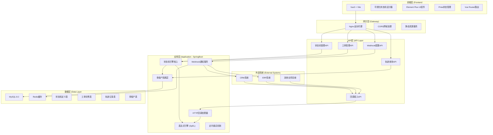
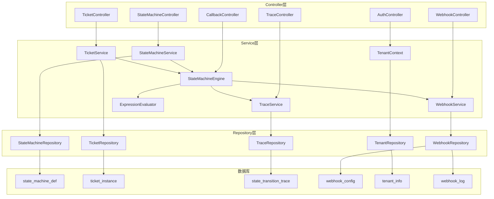
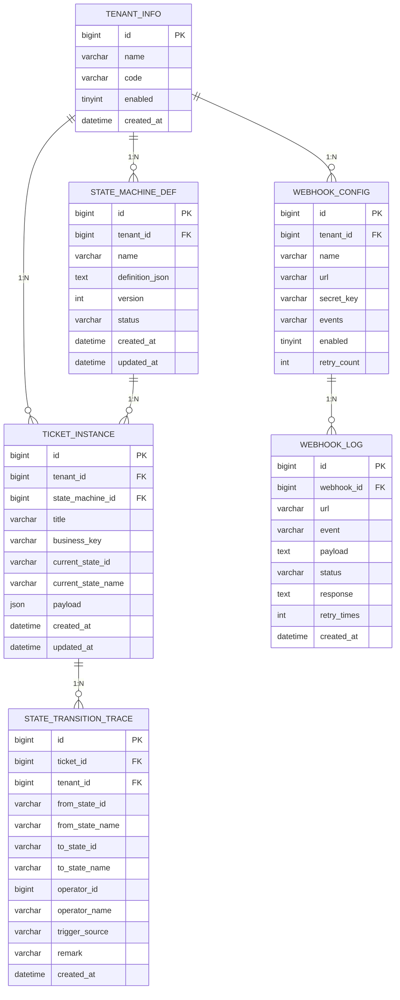

## 1. 架构设计



## 2. 技术描述

### 2.1 前端技术栈
- **框架**：Vue 3.4 + TypeScript 5.0 + Vite 5.0
- **UI组件**：Element Plus 2.7
- **状态管理**：Pinia 2.1
- **路由**：Vue Router 4.3
- **可视化画布**：@antv/x6 2.18 (AntV专业图形编辑引擎)
- **图表**：@antv/g2plot 2.4
- **图标**：lucide-vue-next 0.4
- **HTTP客户端**：Axios 1.7
- **表单校验**：VeeValidate 4.12

### 2.2 后端技术栈
- **框架**：Spring Boot 3.2 + Java 17
- **ORM**：Spring Data JPA 3.2 + Hibernate 6.4
- **数据库**：MySQL 8.0
- **缓存**：Redis 7.0
- **表达式引擎**：Spring Expression Language (SpEL)
- **安全框架**：Spring Security 6.2
- **连接池**：HikariCP 5.0
- **工具库**：Lombok 1.18
- **API文档**：SpringDoc OpenAPI 2.3

### 2.3 关键技术决策

| 技术选型 | 决策理由 |
|-----------|---------|
| @antv/x6 | 专业级图形编辑引擎，支持拖拽、连线、缩放、自定义节点，适合状态机设计器 |
| SpEL表达式 | Spring内置表达式引擎，支持复杂条件表达式，无需引入额外依赖 |
| 多租户schema隔离 | 基于租户ID的逻辑隔离，不同租户数据完全隔离 |
| 数据库行级租户过滤 | JPA + Hibernate过滤器实现自动租户过滤 |
| 异步Webhook通知 | Spring @Async异步执行 + 重试机制保证通知可靠性 |

## 3. 路由定义

### 3.1 前端路由

| 路由路径 | 页面名称 | 组件路径 |
|-----------|---------|----------|
| /login | 登录页 | views/Login.vue |
| /dashboard | 仪表盘 | views/Dashboard.vue |
| /state-machine | 状态机列表 | views/state-machine/List.vue |
| /state-machine/designer/:id | 状态机设计器 | views/state-machine/Designer.vue |
| /ticket | 工单列表 | views/ticket/List.vue |
| /ticket/detail/:id | 工单详情 | views/ticket/Detail.vue |
| /webhook | Webhook配置 | views/webhook/Config.vue |
| /tenant | 租户管理 | views/tenant/List.vue |

### 3.2 后端API路由

| 路由前缀 | 模块 | 说明 |
|-----------|------|------|
| /api/auth | 认证 | 登录、登出、Token刷新 |
| /api/state-machine | 状态机管理 | CRUD、发布、版本管理 |
| /api/ticket | 工单管理 | 创建、查询、状态转移 |
| /api/trace | 轨迹查询 | 工单状态变更历史 |
| /api/webhook | Webhook配置 | CRUD、测试、日志查询 |
| /api/callback | 回调接入 | 外部系统回调入口 |
| /api/tenant | 租户管理 | 租户CRUD |

## 4. API定义

### 4.1 状态机相关API

```typescript
// 状态机定义
interface StateNode {
  id: string;
  name: string;
  type: 'START' | 'NORMAL' | 'END';
  x: number;
  y: number;
  color: string;
  permissions: string[];
}

interface Transition {
  id: string;
  name: string;
  sourceStateId: string;
  targetStateId: string;
  condition: string;
  triggerSource: 'MANUAL' | 'CALLBACK' | 'AUTO';
  callbackSource?: string;
}

interface StateMachine {
  id: number;
  tenantId: number;
  name: string;
  description: string;
  version: number;
  status: 'DRAFT' | 'PUBLISHED' | 'OFFLINE';
  nodes: StateNode[];
  transitions: Transition[];
  createdAt: string;
  updatedAt: string;
}

// 创建状态机
POST /api/state-machine
Request: { name: string; description: string }
Response: StateMachine

// 更新状态机定义
PUT /api/state-machine/{id}
Request: { nodes: StateNode[]; transitions: Transition[] }
Response: StateMachine

// 发布状态机
POST /api/state-machine/{id}/publish
Response: { success: boolean }

// 获取状态机列表
GET /api/state-machine?page=1&size=10
Response: { list: StateMachine[], total: number }
```

### 4.2 工单相关API

```typescript
interface Ticket {
  id: number;
  tenantId: number;
  stateMachineId: number;
  title: string;
  businessKey: string;
  currentStateId: string;
  currentStateName: string;
  payload: Record<string, any>;
  createdAt: string;
  updatedAt: string;
}

interface TransitionRequest {
  ticketId: number;
  targetStateId: string;
  remark?: string;
  triggerData?: Record<string, any>;
}

interface TraceRecord {
  id: number;
  ticketId: number;
  fromStateId: string;
  fromStateName: string;
  toStateId: string;
  toStateName: string;
  operatorId: number;
  operatorName: string;
  triggerSource: string;
  remark: string;
  createdAt: string;
}

// 创建工单
POST /api/ticket
Request: { stateMachineId: number; title: string; businessKey: string; payload: object }
Response: Ticket

// 执行状态转移
POST /api/ticket/{id}/transition
Request: TransitionRequest
Response: { success: boolean; currentStateId: string }

// 工单列表
GET /api/ticket?page=1&size=10&state=PENDING
Response: { list: Ticket[], total: number }

// 工单轨迹
GET /api/trace/ticket/{ticketId}
Response: TraceRecord[]
```

### 4.3 回调接入API

```typescript
// 外部系统回调入口
POST /api/callback/{tenantId}/{callbackSource}
Request Headers: { X-Signature: string
Request Body: {
  businessKey: string;
  eventType: string;
  data: Record<string, any>;
  timestamp: number;
}
Response: {
  success: boolean;
  transitionTriggered: boolean;
  currentState?: string;
  message?: string;
}
```

### 4.4 Webhook配置API

```typescript
interface WebhookConfig {
  id: number;
  tenantId: number;
  name: string;
  url: string;
  events: string[];
  secretKey: string;
  enabled: boolean;
  retryCount: number;
}

// Webhook调用日志
interface WebhookLog {
  id: number;
  webhookId: number;
  url: string;
  event: string;
  payload: string;
  status: 'SUCCESS' | 'FAILED' | 'RETRYING';
  response: string;
  retryTimes: number;
  createdAt: string;
}
```

## 5. 服务器架构图



## 6. 数据模型

### 6.1 ER图



### 6.2 DDL语句

```sql
-- 租户信息表
CREATE TABLE tenant_info (
  id BIGINT PRIMARY KEY AUTO_INCREMENT,
  name VARCHAR(100) NOT NULL COMMENT '租户名称',
  code VARCHAR(50) NOT NULL UNIQUE COMMENT '租户编码',
  enabled TINYINT DEFAULT 1 COMMENT '是否启用',
  created_at DATETIME DEFAULT CURRENT_TIMESTAMP,
  updated_at DATETIME DEFAULT CURRENT_TIMESTAMP ON UPDATE CURRENT_TIMESTAMP,
  INDEX idx_tenant_code (code)
) ENGINE=InnoDB DEFAULT CHARSET=utf8mb4 COMMENT='租户信息表';

-- 状态机定义表
CREATE TABLE state_machine_def (
  id BIGINT PRIMARY KEY AUTO_INCREMENT,
  tenant_id BIGINT NOT NULL COMMENT '租户ID',
  name VARCHAR(100) NOT NULL COMMENT '状态机名称',
  description VARCHAR(500) COMMENT '状态机描述',
  definition_json LONGTEXT COMMENT '状态机定义JSON',
  version INT DEFAULT 1 COMMENT '版本号',
  status VARCHAR(20) DEFAULT 'DRAFT' COMMENT '状态:DRAFT/PUBLISHED/OFFLINE',
  created_at DATETIME DEFAULT CURRENT_TIMESTAMP,
  updated_at DATETIME DEFAULT CURRENT_TIMESTAMP ON UPDATE CURRENT_TIMESTAMP,
  INDEX idx_tenant_id (tenant_id),
  INDEX idx_status (status)
) ENGINE=InnoDB DEFAULT CHARSET=utf8mb4 COMMENT='状态机定义表';

-- 工单实例表
CREATE TABLE ticket_instance (
  id BIGINT PRIMARY KEY AUTO_INCREMENT,
  tenant_id BIGINT NOT NULL COMMENT '租户ID',
  state_machine_id BIGINT NOT NULL COMMENT '状态机ID',
  title VARCHAR(200) NOT NULL COMMENT '工单标题',
  business_key VARCHAR(100) NOT NULL COMMENT '业务主键',
  current_state_id VARCHAR(50) NOT NULL COMMENT '当前状态ID',
  current_state_name VARCHAR(100) NOT NULL COMMENT '当前状态名称',
  payload JSON COMMENT '业务数据负载',
  created_at DATETIME DEFAULT CURRENT_TIMESTAMP,
  updated_at DATETIME DEFAULT CURRENT_TIMESTAMP ON UPDATE CURRENT_TIMESTAMP,
  UNIQUE KEY uk_tenant_business (tenant_id, business_key),
  INDEX idx_tenant_id (tenant_id),
  INDEX idx_state_machine_id (state_machine_id),
  INDEX idx_current_state (current_state_id)
) ENGINE=InnoDB DEFAULT CHARSET=utf8mb4 COMMENT='工单实例表';

-- 状态转移轨迹表
CREATE TABLE state_transition_trace (
  id BIGINT PRIMARY KEY AUTO_INCREMENT,
  ticket_id BIGINT NOT NULL COMMENT '工单ID',
  tenant_id BIGINT NOT NULL COMMENT '租户ID',
  from_state_id VARCHAR(50) NOT NULL COMMENT '源状态ID',
  from_state_name VARCHAR(100) NOT NULL COMMENT '源状态名称',
  to_state_id VARCHAR(50) NOT NULL COMMENT '目标状态ID',
  to_state_name VARCHAR(100) NOT NULL COMMENT '目标状态名称',
  operator_id BIGINT COMMENT '操作人ID',
  operator_name VARCHAR(100) COMMENT '操作人名称',
  trigger_source VARCHAR(50) NOT NULL COMMENT '触发源:MANUAL/CALLBACK/AUTO',
  remark VARCHAR(500) COMMENT '备注',
  created_at DATETIME DEFAULT CURRENT_TIMESTAMP,
  INDEX idx_ticket_id (ticket_id),
  INDEX idx_tenant_id (tenant_id),
  INDEX idx_created_at (created_at)
) ENGINE=InnoDB DEFAULT CHARSET=utf8mb4 COMMENT='状态转移轨迹表';

-- Webhook配置表
CREATE TABLE webhook_config (
  id BIGINT PRIMARY KEY AUTO_INCREMENT,
  tenant_id BIGINT NOT NULL COMMENT '租户ID',
  name VARCHAR(100) NOT NULL COMMENT 'Webhook名称',
  url VARCHAR(500) NOT NULL COMMENT '回调地址',
  secret_key VARCHAR(100) NOT NULL COMMENT '签名密钥',
  events VARCHAR(500) COMMENT '订阅事件列表,逗号分隔',
  enabled TINYINT DEFAULT 1 COMMENT '是否启用',
  retry_count INT DEFAULT 3 COMMENT '重试次数',
  created_at DATETIME DEFAULT CURRENT_TIMESTAMP,
  updated_at DATETIME DEFAULT CURRENT_TIMESTAMP ON UPDATE CURRENT_TIMESTAMP,
  INDEX idx_tenant_id (tenant_id)
) ENGINE=InnoDB DEFAULT CHARSET=utf8mb4 COMMENT='Webhook配置表';

-- Webhook调用日志表
CREATE TABLE webhook_log (
  id BIGINT PRIMARY KEY AUTO_INCREMENT,
  webhook_id BIGINT NOT NULL COMMENT 'Webhook配置ID',
  url VARCHAR(500) NOT NULL COMMENT '调用地址',
  event VARCHAR(50) NOT NULL COMMENT '事件类型',
  payload LONGTEXT COMMENT '请求payload',
  status VARCHAR(20) NOT NULL COMMENT '状态:SUCCESS/FAILED/RETRYING',
  response LONGTEXT COMMENT '响应内容',
  retry_times INT DEFAULT 0 COMMENT '重试次数',
  created_at DATETIME DEFAULT CURRENT_TIMESTAMP,
  INDEX idx_webhook_id (webhook_id),
  INDEX idx_status (status),
  INDEX idx_created_at (created_at)
) ENGINE=InnoDB DEFAULT CHARSET=utf8mb4 COMMENT='Webhook调用日志表';

-- 初始化租户数据
INSERT INTO tenant_info (name, code) VALUES ('默认租户', 'default');
